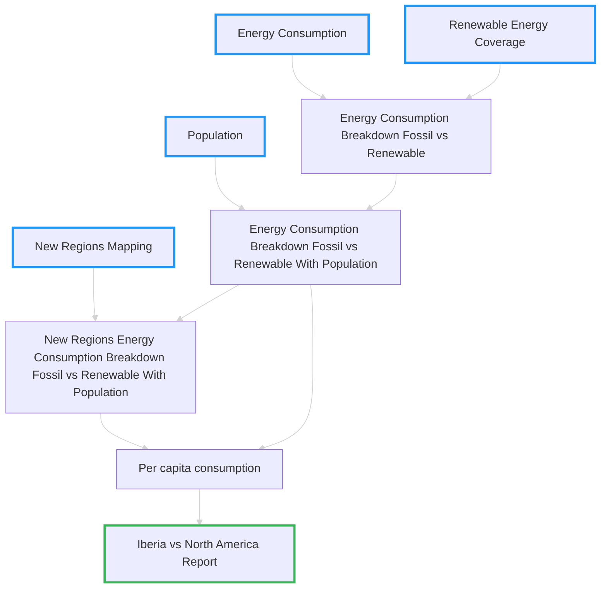

## Scene: María's Data Discovery & Pipeline Planning

Before diving into extraction and transformation, María needs to understand what data she has available and plan her transformation pipeline. Let's explore the datasets and map out the transformation strategy needed to answer her research question: **"How does renewable energy adoption in Iberia compare to North America?"**


*Source of generated image on this page: Google Gemini*

### What We Will Learn

In this section, we will learn to:
- Perform data exploration with `pandas`
- Derive a data architecture to match our requirements

---

## Available Datasets

María has access to four key datasets from [Our World in Data](https://github.com/owid/energy-data)[^1]:

### 1. Population by Country (`population-with-un-projections.csv`)

<div class="table-wrapper" markdown="block">

|Entity|Code|Year|Population|
|:-:|:-:|:-:|:-:|
|Spain|ESP|2020|47,351,567|
|Portugal|PRT|2020|10,295,909|
|United States|USA|2020|329,484,123|
|...|...|...|...|

</div>
### 2. Primary Energy Consumption (`primary-energy-cons.csv`)

<div class="table-wrapper" markdown="block">

|Entity|Code|Year|Primary energy consumption (TWh)|
|:-:|:-:|:-:|:-:|
|Spain|ESP|2020|1234.5|
|Portugal|PRT|2020|234.1|
|United States|USA|2020|25346.8|
|...|...|...|...|

</div>

### 3. Renewable Energy Share (`renewable-share-energy.csv`)

<div class="table-wrapper" markdown="block">

|Entity|Code|Year|Renewables (% equivalent primary energy)|
|:-:|:-:|:-:|:-:|
|Spain|ESP|2020|42.3|
|Portugal|PRT|2020|54.1|
|United States|USA|2020|12.6|
|...|...|...|...|

</div>

### 4. Regional Grouping Taxonomy (`regional-grouping.csv`)

<div class="table-wrapper" markdown="block">

|entity_code|region_name|region_entity_code|
|:-:|:-:|:-:|
|ESP|Iberia|IBE|
|PRT|Iberia|IBE|
|USA|North America|NAM|
|CAN|North America|NAM|
|MEX|North America|NAM|
|...|...|...|

</div>

---

## Initial Data Exploration

Let's perform a quick assessment of our data availability and quality, one of the first steps in any data project. We'll use `pandas` to load and inspect the datasets.


### What is `pandas`?

[Pandas](https://pandas.pydata.org/docs/getting_started/index.html#getting-started) is Python's most popular library for data manipulation and analysis, providing powerful data structures like DataFrames that make working with structured data intuitive and efficient. Throughout this workshop, we'll progressively explore pandas capabilities—from basic data loading and exploration in the extraction phase, to complex transformations and aggregations as we build our ETL pipeline.

### What does this data look like?

```python
import pandas as pd

# Load all datasets
population_df = pd.read_csv("data/population-with-un-projections.csv")
energy_df = pd.read_csv("data/primary-energy-cons.csv")
renewable_df = pd.read_csv("data/renewable-share-energy.csv")
taxonomy_df = pd.read_csv("data/regional-grouping.csv")

# Quick exploration
print("Dataset shapes:")
print(f"Population: {population_df.shape}")
print(f"Energy: {energy_df.shape}")
print(f"Renewable: {renewable_df.shape}")
print(f"Taxonomy: {taxonomy_df.shape}")

# Check date ranges
print("\nYear ranges:")
print(f"Population: {population_df['Year'].min()} - {population_df['Year'].max()}")
print(f"Energy: {energy_df['Year'].min()} - {energy_df['Year'].max()}")
print(f"Renewable: {renewable_df['Year'].min()} - {renewable_df['Year'].max()}")

# Check country coverage
print("\nCountry coverage:")
print(f"Countries in taxonomy: {len(taxonomy_df)}")
print(f"Iberia countries: {taxonomy_df[taxonomy_df['region_name'] == 'Iberia']['entity_code'].tolist()}")
print(f"North America countries: {taxonomy_df[taxonomy_df['region_name'] == 'North America']['entity_code'].tolist()}")
```

---

## Data Gaps & Considerations

### Initial Assessment Questions

1. **Data Completeness:** Do we have all the required countries in each dataset?
2. **Time Alignment:** Do the datasets cover the same time periods?
3. **Data Quality:** Are there missing values or inconsistent formats?
4. **Unit Alignment:** Are energy measurements in comparable units across datasets?

### Key Observations

> **Missing Data:** Some countries may not have renewable energy data for all years
>
> **Unit Conversions:** Energy consumption is in TWh, but we'll need to calculate absolute renewable consumption
>
> **Regional Definitions:** Our taxonomy defines custom regions that don't exist in the raw data

---

## Understanding the Data Challenge

We have seen these sources on their own do not directly answer María's question:

**"How does renewable energy adoption in Iberia compare to North America?"**

> 1. All the energy data is country-level, no awareness of region-level data.
>
> 2. No direct measure of renewable energy consumption, only percentage share.
>
> 3. No data for fossil energy consumption.
>
> 4. Data is not normalized to do a "share" comparison, e.g. United States has a much larger population than Spain.


However, María is smart, she figured we can combine these datasets to derive the insights we need:

1. If I have a grouping, I can **aggregate country-level into region-level**.
2. If I have total consumption and percentage renewable, I can **derive renewable consumption**.
3. If I have total renewable consumption, I can **derive fossil consumption**.
4. If I have population, I can normalize consumption into a more indicative **per-person amount**.

---

## Transformation Pipeline Design

To answer María's research question, we need to design a pipeline that transforms country-level data into regional comparisons in order to produce her `Iberia vs North America report`:

### Pipeline Overview



## Expected Output Structure

Our final dataset should enable comparisons like this:

<div class="table-wrapper" markdown="block">

|entity|entity_code|year|energy_consumption|renewable_energy_pct|fossil_energy_pct|renewable_energy_consumption|fossil_energy_consumption|population|energy_consumption_per_capita|renewable_energy_per_capita|fossil_energy_per_capita|
|:-:|:-:|:-:|:-:|:-:|:-:|:-:|:-:|:-:|:-:|:-:|:-:|
|Iberia|IBE|2020|1,468.6|45.2|54.8|663.8|804.8|57,647,476|25.47|11.51|13.96|
|North America|NAM|2020|27,234.5|13.8|86.2|3,758.4|23,476.1|368,869,647|73.84|10.19|63.65|

</div>

---

## Key Questions to Answer

With this transformed data, María will be able to answer:

1. **Overall Consumption:** Which region consumes more energy per capita?
2. **Renewable Adoption:** Which region has a higher percentage of renewable energy?
3. **Absolute Impact:** Which region consumes more renewable energy per capita?
4. **Trends Over Time:** How has renewable adoption changed in each region?
5. **Policy Implications:** What insights can inform renewable energy policy?

---

## Pipeline Challenges We'll Address

As we build this pipeline, we'll encounter several challenges that modern orchestration tools help solve:

- **Data Validation:** Ensuring incoming data meets our expectations
- **Dependency Management:** Tracking which transformations depend on which data sources
- **Error Handling:** Gracefully handling missing data or calculation errors
- **Reproducibility:** Ensuring the pipeline produces consistent results
- **Monitoring:** Tracking data quality and pipeline performance over time

---

## Ready to Build?

Now that we understand our data and have planned our transformation pipeline, let's start building! In the next section, we'll begin with the "Extract" phase, learning how to load and validate our raw data sources.

**Next:** Part 1 - The "E": Extracting & Initial Cleaning

---

Atrributions

[^1]: Our World in Data (https://ourworldindata.org/) - Data made available under Creative Commons BY license (CC BY 4.0). https://creativecommons.org/licenses/by/4.0/
