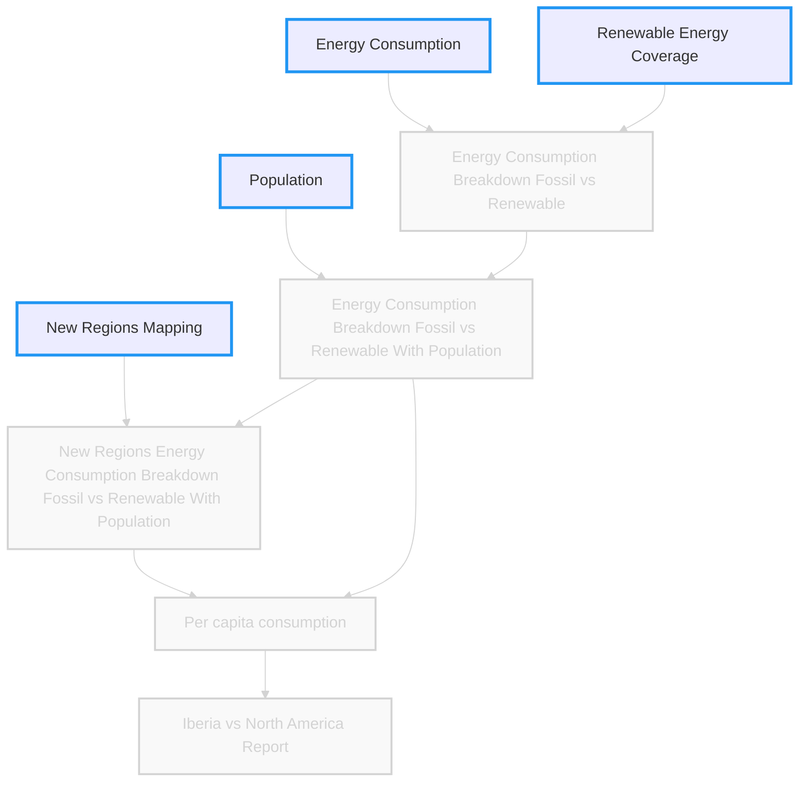

## Scene: The journey begins by getting the raw data into a usable format

Before orchestrating anything, María needs to get her hands on the raw data: population, energy consumption, renewable share, and country taxonomy. Let's see how this is typically done.


### What We Will Learn

- Load raw `CSV` files into `pandas` DataFrames
- Standardize column names and handle missing values
- Convert data to appropriate types and handle conversion errors
- Use `pandera` schemas to define and enforce data expectations
- Transform ad-hoc scripts into trackable `Dagster` assets

---

## Data Architecture Evolution

We will retrieve the foundational data sources to feed our analysis pipeline, the **"E" in ETL - Extract**.



## Basic Approach (Plain Python & Pandas)

### How to Load Data with Pandas

```python
import pandas as pd

population_df = pd.read_csv("data/population-with-un-projections.csv")
energy_df = pd.read_csv("data/primary-energy-cons.csv")
renewable_df = pd.read_csv("data/renewable-share-energy.csv")
taxonomy_df = pd.read_csv("data/regional-grouping.csv")
```

### Quick Exploration

```python
print(population_df.head())
print(population_df.info())
print(population_df.describe())
```

### Standardize the Column Names

```python
# Rename columns for consistency
population_df = population_df.rename(
    columns={
        "population__sex_all__age_all__variant_estimates": "population",
        "Entity": "entity",
        "Code": "entity_code",
        "Year": "year",
    }
)
# Select only the standardized columns
population_df = population_df[["entity", "entity_code", "year", "population"]]
```

### Assign Types

```python
# Convert to appropriate types
population_df = population_df.astype({"year": int, "population": int, "entity_code": str, "entity": str})
```

> #### Type convertion errors
>
> There are some types that you might need to carefully think about, check the [dtypes](https://pandas.pydata.org/docs/user_guide/basics.html#basics-dtypes) documentation to learn more.
{: .block-danger }

After reading our data, we can notice the population contains `NULL` values. _How can we handle this?_

> #### Solution
>
> In the context of our exercise, the simplest solution is to clean-up the missing data as part of your extraction process.
>
{: .block-tip }

<details markdown="1">
<summary><strong>💡 Click to reveal solution</strong></summary>

```python
population_df = (
    population_df.rename(
        columns={
            "population__sex_all__age_all__variant_estimates": "population",
            "Entity": "entity",
            "Code": "entity_code",
            "Year": "year",
        }
    )
    .dropna(subset=["population"])
    .astype({"year": int, "population": int, "entity_code": str, "entity": str})
)
```

</details>

---

### Demonstrate Failure

If you change a population value to `"unknown"` or add a country not in the taxonomy, the pipeline will either:

- Throw a generic exception (e.g., `ValueError: could not convert string to float`)
- Or silently produce incorrect results, with no clear error reporting.

---

### Problem Highlight

> This works for small datasets, but what if files are missing? What if the columns change? How do we ensure consistency and traceability for all our inputs?

---

## Advanced Approach (Dagster Assets & Pandera for Input Validation)

As our data workflows grow, we need tools that help us manage complexity, ensure data quality, and provide visibility into each step. Two powerful tools for this are:

- **[Dagster](https://docs.dagster.io/):** An open-source data orchestrator that lets you define, track, and monitor each step of your pipeline as reusable, observable "assets."
- **[Pandera](https://pandera.readthedocs.io):** A Python library for validating pandas DataFrames using expressive, schema-based contracts. It ensures your data meets expectations before it enters your pipeline.

With `Dagster`, you can treat each raw data source as a trackable asset, and with Pandera, you can enforce strict data contracts to catch issues early.

---

### Setting Up `Dagster` Locally

To use `Dagster` for asset-based data extraction and validation, follow these steps to scaffold your project and start the development server:

#### 1. Scaffold a New Dagster Project

```bash
create-dagster project energy-analysis
cd energy-analysis
```

#### 2. Scaffold Asset Definitions

```bash
dg scaffold defs dagster.asset assets.py
```

This will create an `assets.py` file where you can define your Dagster assets.

#### 3. Start the Dagster Development Server

```bash
dg dev
```

This launches the Dagster UI locally, allowing you to run, monitor, and debug your asset-based pipelines.

---

### Dagster for "Extract" as Assets

Instead of ad-hoc loading, define each raw data source as a Dagster `Asset`:

```python
import dagster as dg
import pandas as pd

@dg.asset
def population_by_country():
    """Population by country from UN projections"""
    return pd.read_csv("src/energy_analysis/data/population-with-un-projections.csv")
```

This makes each input visible, trackable, and versioned.

---

### Pandera for Data Contracts

Define a data model for each dataset:

```python
import pandera as pa

class PopulationDataModel(pa.DataFrameModel):
    entity: str = pa.Field(description="Country name")
    entity_code: str = pa.Field(description="Country code")
    year: int = pa.Field(description="Year of the population estimate")
    population: int = pa.Field(description="Population estimate", nullable=True)
```

Add validation to the asset using dagster types:

```python
@dg.asset(dagster_type=pandera_schema_to_dagster_type(PopulationDataModel.to_schema()))
def population_by_country():
    """Population by country from UN projections"""
    return pd.read_csv("src/energy_analysis/data/population-with-un-projections.csv")
```

**Why Pandera?** It is a complete semantic data validation framework; at its core, it validates data schemas automatically, preventing bad data from entering your pipeline and providing clear error messages when validation fails.


> #### Dagster Type Checks
>
> Dagster performs validation against the schema defined, if any of the checks fails you will see
> a STEP_FAILURE in your materialization output
{: .block-danger }

> #### Solution
>
> Clean-up the data as part of your extraction asset
>
{: .block-tip }

<details markdown="1">
<summary><strong>💡 Click to reveal solution</strong></summary>

```python
@dg.asset(dagster_type=pandera_schema_to_dagster_type(PopulationDataModel.to_schema()))
def population_by_country():
    """Population by country from UN projections"""
    return (
        pd.read_csv("src/energy_analysis/data/population-with-un-projections.csv")
        .rename(
            columns={
                "population__sex_all__age_all__variant_estimates": "population",
                "Entity": "entity",
                "Code": "entity_code",
                "Year": "year",
            }
        )
        .dropna(subset=["population"])
        .astype({"year": int, "population": int, "entity_code": str, "entity": str})
    )
```

</details>

---

### Demonstrate: Pandera Prevents Bad Data

If you for example change the type of population from `int` to `float`, when materializing the asset you will see an actionable error. Dagster will surface this error in its UI/logs, showing exactly which asset and which row failed.

```python
dagster._core.errors.DagsterTypeCheckDidNotPass: Type check failed for step output "result" - expected type "PopulationDataModel". Description: {
    "SCHEMA": {
        "WRONG_DATATYPE": [
            {
                "schema": "PopulationDataModel",
                "column": "population",
                "check": "dtype('float64')",
                "error": "expected series 'population' to have type float64, got int64"
            }
        ]
    }
}
```

## Hands-on

Let's define our raw data sources as `Dagster` assets, add `Pandera` schemas to ensure they meet our basic expectations for structure and type, and see how our tools catch the data error we introduced.

<details markdown="1">
<summary><strong>💡 Click to reveal solution</strong></summary>

*assets.py*
```python
import dagster as dg
import pandas as pd
from dagster_pandera import pandera_schema_to_dagster_type


from energy_analysis.defs.models import (
    PopulationDataModel,
    EnergyConsumptionDataModel,
    RenewableCoverageDataModel,
    RegionalGroupingDataModel,
)


@dg.asset(dagster_type=pandera_schema_to_dagster_type(PopulationDataModel.to_schema()))
def population():
    """Population by country from UN projections"""
    return (
        pd.read_csv("src/energy_analysis/data/population-with-un-projections.csv")
        .rename(
            columns={
                "population__sex_all__age_all__variant_estimates": "population",
                "Entity": "entity",
                "Code": "entity_code",
                "Year": "year",
            }
        )
        .dropna(subset=["population"])
        .astype({"year": int, "population": int, "entity_code": str, "entity": str})
    )


@dg.asset(
    dagster_type=pandera_schema_to_dagster_type(EnergyConsumptionDataModel.to_schema())
)
def energy_consumption():
    """Energy consumption by country from UN projections"""
    return (
        pd.read_csv("src/energy_analysis/data/primary-energy-cons.csv")
        .rename(
            columns={
                "primary_energy_consumption__twh": "energy_consumption",
                "Entity": "entity",
                "Code": "entity_code",
                "Year": "year",
            }
        )
        .astype(
            {
                "year": int,
                "energy_consumption": float,
                "entity_code": str,
                "entity": str,
            }
        )
    )


@dg.asset(
    dagster_type=pandera_schema_to_dagster_type(RenewableCoverageDataModel.to_schema())
)
def renewable_coverage():
    """Renewable energy coverage by country from UN projections"""
    return (
        pd.read_csv("src/energy_analysis/data/renewable-share-energy.csv")
        .rename(
            columns={
                "renewables__pct_equivalent_primary_energy": "renewable_energy_pct",
                "Entity": "entity",
                "Code": "entity_code",
                "Year": "year",
            }
        )
        .assign(renewable_energy_pct=lambda x: x["renewable_energy_pct"] / 100)
    )


@dg.asset(
    dagster_type=pandera_schema_to_dagster_type(RegionalGroupingDataModel.to_schema())
)
def regional_grouping():
    """Regional grouping taxonomy"""
    return pd.read_csv("src/energy_analysis/data/regional-grouping.csv")

```

*models.py*
```python
import pandera as pa


class PopulationDataModel(pa.DataFrameModel):
    entity: str = pa.Field(description="Entity name")
    entity_code: str = pa.Field(description="Country code")
    year: int = pa.Field(description="Year of the population estimate")
    population: int = pa.Field(description="Population estimate")


class EnergyConsumptionDataModel(pa.DataFrameModel):
    entity: str = pa.Field(description="Entity name")
    entity_code: str = pa.Field(description="Country code")
    year: int = pa.Field(description="Year of the consumption")
    energy_consumption: float = pa.Field(description="Energy consumption in TWh")


class RenewableCoverageDataModel(pa.DataFrameModel):
    entity: str = pa.Field(description="Entity name")
    entity_code: str = pa.Field(description="Country code", nullable=True)
    year: int = pa.Field(description="Year of the estimate")
    renewable_energy_pct: float = pa.Field(description="Renewable energy coverage in %")


class RegionalGroupingDataModel(pa.DataFrameModel):
    region_entity_code: str = pa.Field(description="Region entity code")
    region_name: str = pa.Field(description="Region name")
    entity_code: str = pa.Field(description="Country code")
```
</details>

---

## Moment of Discovery

> By defining our raw data as `Dagster` assets and enforcing `Pandera` contracts, we've built a robust 'intake system' that ensures our foundation is solid and traceable, and can proactively identify data quality issues.


**Next:** Move on to transforming your raw inputs and create new energy data!
