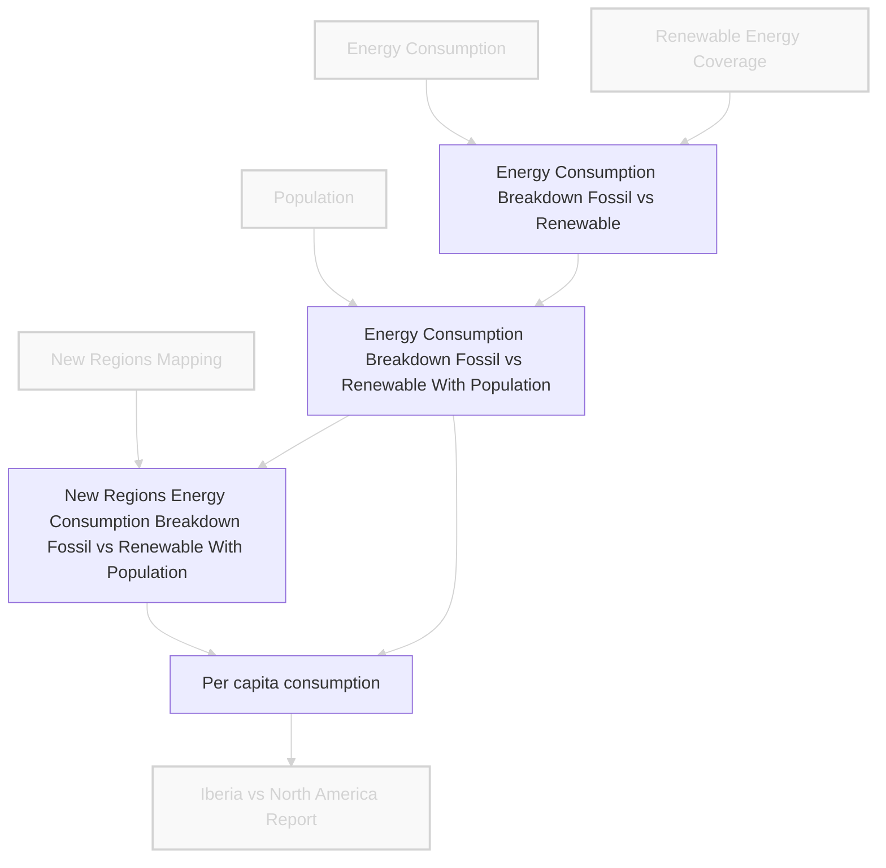

## Scene: It's time to transform the extracted data into the desired format for analysis

With our raw data sources properly validated and loaded, María needs to combine and transform this data to answer her policy questions. This involves merging datasets, calculating derived metrics, and creating regional aggregates for comparison.


### What We Will Learn

- Transform and combine multiple datasets for analysis `pandas`
- Create regional aggregates and derived metrics
- Visualize data dependencies and pipeline lineage
- Move from ad-hoc scripts to structured, maintainable workflows using `Dagster` assets

## Data Architecture Evolution

We will transform and enrich our starting data to create meaningful insights, the **"T" in ETL - Transform**.



---

## Basic Approach: Complex Pandas Transformations

In this section, we'll demonstrate a traditional approach to data transformation using `pandas`. María needs to combine multiple datasets - energy consumption, renewable energy percentages, population data, and regional taxonomies - to create comprehensive analytics ready for policy analysis. We'll walk through a series of pandas operations that merge, calculate, and aggregate this data, but we'll also highlight the challenges that arise when managing complex transformation pipelines without proper orchestration tools.

### Combine Energy Data Sources

```python
# Merge energy consumption with renewable percentages
energy_breakdown = energy_consumption_df.merge(
    renewable_energy_df, how="left", on=["entity", "entity_code", "year"]
).assign(
    renewable_energy_pct=lambda x: x["renewable_energy_pct"].fillna(0),
    fossil_energy_pct=lambda x: 1 - x["renewable_energy_pct"],
    renewable_energy_consumption_gwh=lambda x: x["energy_consumption_gwh"] * x["renewable_energy_pct"],
    fossil_energy_consumption_gwh=lambda x: x["energy_consumption_gwh"] * x["fossil_energy_pct"],
)
```

### Add Population Data

```python
# Merge with population data
energy_with_population = energy_breakdown.merge(
    population_df, how="left", on=["entity", "entity_code", "year"]
)
```

### Create Regional Aggregates

```python
# Manually define regions using taxonomy
entities_of_interest = energy_with_population.merge(
    taxonomy_df, on="entity_code"
).assign(
    relative_contrib_in_region=lambda x: x["energy_consumption_gwh"]
    / x.groupby(["region_entity_code", "year"])["energy_consumption_gwh"].transform("sum")
)

regional_aggregates = (
    entities_of_interest.assign(
        renewable_energy_pct=lambda x: x["renewable_energy_pct"] * x["relative_contrib_in_region"],
        fossil_energy_pct=lambda x: x["fossil_energy_pct"] * x["relative_contrib_in_region"],
    )
    .groupby(["region_entity_code", "region_name", "year"], as_index=False)
    .agg({
        "population": "sum",
        "energy_consumption_gwh": "sum",
        "renewable_energy_consumption_gwh": "sum",
        "fossil_energy_consumption_gwh": "sum",
        "renewable_energy_pct": "sum",
        "fossil_energy_pct": "sum",
    })
    .rename(columns={"region_name": "entity", "region_entity_code": "entity_code"})
)
```

### Hands-on

Let's create the per-capita metrics `DataFrame` by ourselves.

<details markdown="1">
<summary><strong>💡 Click to reveal solution</strong></summary>

```python
# Calculate per-capita consumption
per_capita_consumption = pd.concat([regional_aggregates, energy_with_population]).assign(
    energy_consumption_per_capita_gwh=lambda x: x["energy_consumption_gwh"] / x["population"],
    renewable_energy_per_capita_gwh=lambda x: x["renewable_energy_consumption_gwh"] / x["population"],
    fossil_energy_per_capita_gwh=lambda x: x["fossil_energy_consumption_gwh"] / x["population"],
)
```

</details>

#### Problem Highlight

> While pandas is powerful, managing a sequence of complex transformations, tracking intermediate steps, and ensuring reproducibility becomes a 'spaghetti code' challenge. How do we know if a change upstream impacts a calculation far downstream?

---

## Advanced Approach: Dagster Assets for Transformations

In this advanced approach, we'll restructure our complex pandas transformations into a series of well-defined `Dagster` assets. This strategy transforms our monolithic transformation code into discrete, trackable components that can be monitored, validated, and reused independently. Each transformation step becomes an asset with clear inputs and outputs, making the entire pipeline more maintainable and debuggable.

### Setting Up Transform Assets

Break down the complex transformations into discrete, trackable Dagster assets:

```python
class EnergyBreakdownDataModel(EnergyConsumptionDataModel):
    renewable_energy_pct: float = pa.Field(description="Renewable energy coverage in %")
    fossil_energy_pct: float = pa.Field(description="Fossil energy coverage in %")
    renewable_energy_consumption: float = pa.Field(
        description="Renewable energy consumption in GWh"
    )
    fossil_energy_consumption: float = pa.Field(
        description="Fossil energy consumption in GWh"
    )


@dg.asset(
    dagster_type=pandera_schema_to_dagster_type(EnergyBreakdownDataModel.to_schema())
)
def energy_breakdown(energy_consumption, renewable_coverage):
    """Combine energy consumption with renewable percentages to calculate fossil vs renewable breakdown"""
    return energy_consumption.merge(
        renewable_coverage, how="left", on=["entity", "entity_code", "year"]
    ).assign(
        renewable_energy_pct=lambda x: x["renewable_energy_pct"].fillna(0),
        fossil_energy_pct=lambda x: 1 - x["renewable_energy_pct"],
        renewable_energy_consumption=lambda x: x["energy_consumption"] * x["renewable_energy_pct"],
        fossil_energy_consumption=lambda x: x["energy_consumption"] * x["fossil_energy_pct"],
    )
```

### Demonstrate Dagster's Lineage & UI

The Dagster UI now clearly visualizes the dependencies between these transformed assets, offering a clear "map" of María's data pipeline:


### Hands-on

Let's convert our complex pandas transformations into structured Dagster assets and add asset checks to ensure the quality of our intermediate and final calculated metrics.

<details markdown="1">
<summary><strong>💡 Click to reveal solution</strong></summary>


```python

@dg.asset(
    dagster_type=pandera_schema_to_dagster_type(EnergyBreakdownDataModel.to_schema())
)
def energy_breakdown(energy_consumption, renewable_coverage):
    """Combine energy consumption with renewable percentages to calculate fossil vs renewable breakdown"""
    return energy_consumption.merge(
        renewable_coverage, how="left", on=["entity", "entity_code", "year"]
    ).assign(
        renewable_energy_pct=lambda x: x["renewable_energy_pct"].fillna(0),
        fossil_energy_pct=lambda x: 1 - x["renewable_energy_pct"],
        renewable_energy_consumption=lambda x: x["energy_consumption"]
        * x["renewable_energy_pct"],
        fossil_energy_consumption=lambda x: x["energy_consumption"]
        * x["fossil_energy_pct"],
    )


@dg.asset(
    dagster_type=pandera_schema_to_dagster_type(
        EnergyBreakdownWithPopulationDataModel.to_schema()
    )
)
def energy_breakdown_with_population(energy_breakdown, population):
    """Combine energy breakdown with population data"""
    return energy_breakdown.merge(
        population, how="left", on=["entity", "entity_code", "year"]
    ).astype({"population": "Int64"})


@dg.asset(
    dagster_type=get_dagster_type(
        EnergyBreakdownWithPopulationDataModel, "energy_breakdown_with_new_regions"
    )
)
def energy_breakdown_with_new_regions(
    energy_breakdown_with_population, regional_grouping
):
    """Combine energy breakdown with new regional data"""
    entities_of_interest = energy_breakdown_with_population.merge(
        regional_grouping, on="entity_code"
    )

    return (
        entities_of_interest.groupby(
            [
                "region_entity_code",
                "region_name",
                "year",
            ],
            as_index=False,
        )
        .agg(
            {
                "population": "sum",
                "energy_consumption": "sum",
                "renewable_energy_consumption": "sum",
                "fossil_energy_consumption": "sum",
            }
        )
        .assign(
            renewable_energy_pct=lambda x: x["renewable_energy_consumption"]
            / x["energy_consumption"],
            fossil_energy_pct=lambda x: x["fossil_energy_consumption"]
            / x["energy_consumption"],
        )
        .rename(columns={"region_name": "entity", "region_entity_code": "entity_code"})
    )


@dg.asset(dagster_type=get_dagster_type(EnergyBreakdownPerCapitaDataModel))
def energy_breakdown_per_capita(
    energy_breakdown_with_population, energy_breakdown_with_new_regions
):
    """Compute per-capita energy consumption metrics"""
    all_breakdowns = pd.concat(
        [energy_breakdown_with_population, energy_breakdown_with_new_regions]
    )
    return all_breakdowns.assign(
        energy_consumption_per_capita=lambda x: x["energy_consumption"]
        / x["population"],
        renewable_energy_per_capita=lambda x: x["renewable_energy_consumption"]
        / x["population"],
        fossil_energy_per_capita=lambda x: x["fossil_energy_consumption"]
        / x["population"],
    )

```

</details>

---

## Moment of Discovery

> `Dagster` provides the 'architect's blueprint' for our transformations, ensuring clarity and traceability, while the UI gives us complete visibility into our data lineage.
> 1. **Raw Data Assets** → **Energy Breakdown** → **Energy with Population** → **Regional Aggregates** → **Per-Capita Metrics**
2. **Lineage View** shows how changes propagate through the pipeline
3. **Asset Materialization History** tracks when each step was last updated

**Next:** Move on to the final step - Loading and generating insights from our transformed data!
