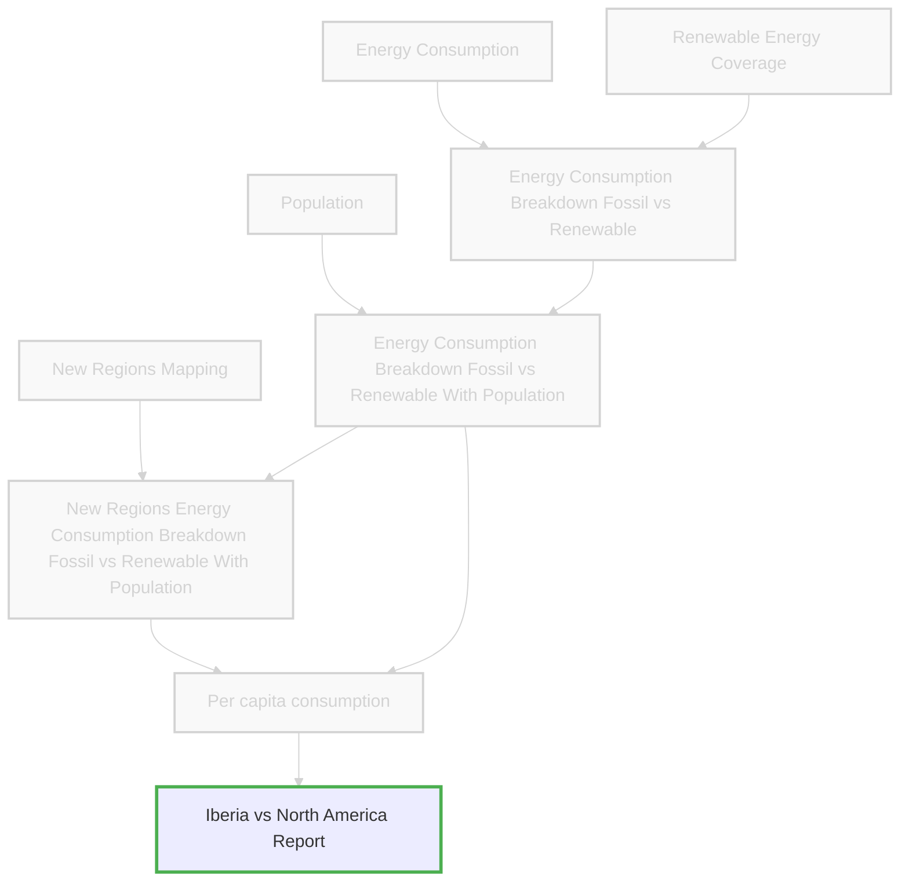

## Scene: With the data extracted and transformed, the final step is to make it accessible and use it to answer María's policy questions

This is where the fruits of her ETL labor are realized, and she produces a comprehensive Excel report as part of her exploratory data analysis. The "L" in ETL isn't just about loading data into storage - it's about making insights accessible and actionable for policy decisions.


*Source of generated image on this page: Google Gemini*

### What We Will Learn

- Transform analysis results into consumable outputs and reports

---

ℹ️ If you have fallen behind, you can `git checkout part_2` before starting this section.

For the `advanced` section, you can the re-run `dg dev` to restart your `Dagster` webserver.

---

## Data Architecture Evolution

We will load and leverage our transformed data to create policy insights, completing the **"L" in ETL - Load**.



---

## Basic Approach: Manual Output & Ad-hoc Analysis

### Loading the data

A basic way to simply export the data is to create an output file.

```python
energy_breakdown_per_capita.to_csv('per_capita_metrics.csv')
```

From `Dagster` we can also be done through a materializable asset.

```python
@dg.asset()
def export_energy_breakdown(energy_breakdown_per_capita):
    """Export data as pure CSV"""
    energy_breakdown_per_capita.to_csv('per_capita_metrics.csv')
```


### Create Excel Report

Another common case comprehensive energy report consists of seven tabs:

- **Tab 1**: Top 10 regions by year with highest fossil energy consumption
- **Tab 2**: Top 10 regions by year with highest renewable energy consumption
- **Tab 3**: North America vs Iberia renewable energy consumption per capita comparison
- **Tab 4**: North America vs Iberia total energy consumption comparison
- **Tab 5**: North America vs Iberia energy mix breakdown comparison
- **Tab 6**: North America vs Iberia energy efficiency trends comparison
- **Tab 7**: Raw data and source information

```python
from openpyxl.chart import LineChart, Reference

filename = "energy_analysis_report.xlsx"
with pd.ExcelWriter(filename, engine="openpyxl") as writer:
    latest_year_with_population = per_capita_metrics.loc[
        per_capita_metrics["population"].notna(), "year"
    ].max()

    # Remove invalid data
    valid_energy_data = per_capita_metrics.loc[
        lambda x: (
            (x["renewable_energy_per_capita_gwh"].notna())
            & (x["renewable_energy_per_capita_gwh"] != float("inf"))
            & (x["fossil_energy_per_capita_gwh"].notna())
            & (x["fossil_energy_per_capita_gwh"] != float("inf"))
            & (x["energy_consumption_per_capita_gwh"].notna())
            & (x["energy_consumption_per_capita_gwh"] != float("inf"))
        )
    ].reset_index()

    # Tab 1: Top 10 Renewable Energy Consumers by Max Year
    (
        valid_energy_data.loc[
            valid_energy_data.groupby("entity")[
                "renewable_energy_per_capita_gwh"
            ].idxmax()
        ]
        .nlargest(10, "renewable_energy_per_capita_gwh")[
            ["entity", "year", "renewable_energy_per_capita_gwh"]
        ]
        .to_excel(writer, sheet_name="Top_10_Renewable_Max", index=False)
    )

    # Tab 2: Top 10 Fossil Energy Consumers by Max Year
    (
        valid_energy_data.loc[
            valid_energy_data.groupby("entity")["fossil_energy_per_capita_gwh"].idxmax()
        ]
        .nlargest(10, "fossil_energy_per_capita_gwh")[
            ["entity", "year", "fossil_energy_per_capita_gwh"]
        ]
        .to_excel(writer, sheet_name="Top_10_Fossil_Max", index=False)
    )
    # Tab 3: NAM vs IBERIA Comparison (past 10 years, pivoted by year)
    past_10_years = latest_year_with_population - 9
    nam_iberia_data = valid_energy_data.loc[
        lambda x: (x["year"] >= past_10_years)
        & (x["entity"].isin(["North America", "Iberia"]))
    ][
        [
            "entity",
            "year",
            "renewable_energy_per_capita_gwh",
            "fossil_energy_pct",
            "energy_consumption_per_capita_gwh",
        ]
    ]

    metric_labels = {
        "renewable_energy_per_capita_gwh": "Renewable_Energy_Per_Capita",
        "fossil_energy_pct": "Fossil_Energy_Percent",
        "energy_consumption_per_capita_gwh": "Energy_per_Capita",
    }

    # Pivot data with years as rows and regions as columns
    for metric in [
        "renewable_energy_per_capita_gwh",
        "fossil_energy_pct",
        "energy_consumption_per_capita_gwh",
    ]:
        pivoted = nam_iberia_data.pivot(
            index="year", columns="entity", values=metric
        )
        pivoted.to_excel(writer, sheet_name=metric_labels[metric])

    # Add chart to Renewable Energy sheet as example
    ws_renewable = writer.sheets["Renewable_Energy_Per_Capita"]
    chart = LineChart()
    chart.title = "NAM vs Iberia: Renewable Energy Per Capita Over Time"

    # Get the data range (assuming years are in column A, regions in columns B and C)
    max_row = (
        len(
            nam_iberia_data.pivot(
                index="year",
                columns="entity",
                values="renewable_energy_per_capita_gwh",
            )
        )
        + 1
    )

    # Add data for North America (column B)
    data_nam = Reference(ws_renewable, min_col=2, min_row=1, max_row=max_row)
    chart.add_data(data_nam, titles_from_data=True)

    # Add data for Iberia (column C)
    data_iberia = Reference(ws_renewable, min_col=3, min_row=1, max_row=max_row)
    chart.add_data(data_iberia, titles_from_data=True)

    # Set categories (years from column A)
    categories = Reference(ws_renewable, min_col=1, min_row=2, max_row=max_row)
    chart.set_categories(categories)

    # Enable legend below the chart
    chart.legend.position = "b"  # Position legend at bottom
    chart.legend.overlay = False  # Don't overlay on chart area

    # Add chart to worksheet
    ws_renewable.add_chart(chart, "E2")


    # Tab 4: Full raw data
    per_capita_metrics.to_excel(writer, sheet_name="Raw_Data", index=False)

print(f"Excel report exported to: {filename}")
```

#### Problem Highlight

> While creating an Excel report works, how do we ensure this report stays updated as data changes? How do we add charts programmatically? And how can we make this analysis repeatable and trackable within our pipeline?

---

## Advanced Approach: Dagster Assets for Comprehensive Reporting

### Comprehensive Excel Report Generation

Transform the Excel creation into a structured Dagster asset. Now that we are familiar with Dagster, we should be capable of doing it ourselves.

<details markdown="1">
<summary><strong>💡 Click to reveal solution</strong></summary>

```python
@dg.asset()
def export_analysis_report(energy_breakdown_per_capita):
    """Export analysis report to Excel with multiple tabs and charts"""

    filename = "energy_analysis_report.xlsx"
    with pd.ExcelWriter(filename, engine="openpyxl") as writer:
        latest_year_with_population = energy_breakdown_per_capita.loc[
            energy_breakdown_per_capita["population"].notna(), "year"
        ].max()

        # Remove invalid data
        valid_energy_data = energy_breakdown_per_capita.dropna(
            subset=["renewable_energy_per_capita", "fossil_energy_per_capita", "energy_consumption_per_capita"]
        ).replace([float("inf"), -float("inf")], pd.NA).dropna().reset_index()

        # Tab 1: Top 10 Renewable Energy Consumers by Max Year
        (
            valid_energy_data.loc[
                valid_energy_data.groupby("entity")[
                    "renewable_energy_per_capita"
                ].idxmax()
            ]
            .nlargest(10, "renewable_energy_per_capita")[
                ["entity", "year", "renewable_energy_per_capita"]
            ]
            .to_excel(writer, sheet_name="Top_10_Renewable_Max", index=False)
        )

        # Tab 2: Top 10 Fossil Energy Consumers by Max Year
        (
            valid_energy_data.loc[
                valid_energy_data.groupby("entity")["fossil_energy_per_capita"].idxmax()
            ]
            .nlargest(10, "fossil_energy_per_capita")[
                ["entity", "year", "fossil_energy_per_capita"]
            ]
            .to_excel(writer, sheet_name="Top_10_Fossil_Max", index=False)
        )
        # Tab 3: NAM vs IBERIA Comparison (past 10 years, pivoted by year)
        past_10_years = latest_year_with_population - 9
        nam_iberia_data = valid_energy_data.loc[
            lambda x: (x["year"] >= past_10_years)
            & (x["entity"].isin(["North America", "Iberia"]))
        ][
            [
                "entity",
                "year",
                "renewable_energy_per_capita",
                "fossil_energy_pct",
                "energy_consumption_per_capita",
            ]
        ]

        metric_labels = {
            "renewable_energy_per_capita": "Renewable_Energy_Per_Capita",
            "fossil_energy_pct": "Fossil_Energy_Percent",
            "energy_consumption_per_capita": "Energy_per_Capita",
        }

        # Pivot data with years as rows and regions as columns
        for metric in [
            "renewable_energy_per_capita",
            "fossil_energy_pct",
            "energy_consumption_per_capita",
        ]:
            pivoted = nam_iberia_data.pivot(
                index="year", columns="entity", values=metric
            )
            pivoted.to_excel(writer, sheet_name=metric_labels[metric])

        # Add chart to Renewable Energy sheet as example
        ws_renewable = writer.sheets["Renewable_Energy_Per_Capita"]
        chart = LineChart()
        chart.title = "NAM vs Iberia: Renewable Energy Per Capita Over Time"

        # Get the data range (assuming years are in column A, regions in columns B and C)
        max_row = (
            len(
                nam_iberia_data.pivot(
                    index="year",
                    columns="entity",
                    values="renewable_energy_per_capita",
                )
            )
            + 1
        )

        # Add data for North America (column B)
        data_nam = Reference(ws_renewable, min_col=2, min_row=1, max_row=max_row)
        chart.add_data(data_nam, titles_from_data=True)

        # Add data for Iberia (column C)
        data_iberia = Reference(ws_renewable, min_col=3, min_row=1, max_row=max_row)
        chart.add_data(data_iberia, titles_from_data=True)

        # Set categories (years from column A)
        categories = Reference(ws_renewable, min_col=1, min_row=2, max_row=max_row)
        chart.set_categories(categories)

        # Enable legend below the chart
        chart.legend.position = "b"  # Position legend at bottom
        chart.legend.overlay = False  # Don't overlay on chart area

        # Add chart to worksheet
        ws_renewable.add_chart(chart, "E2")

        print(f"Excel report exported to: {filename}")

        # Tab 4: Full raw data
        energy_breakdown_per_capita.to_excel(writer, sheet_name="Raw_Data", index=False)
```
</details>


### Demonstrate Asset-Based Reporting Benefits

The Dagster UI now shows María's complete pipeline from raw data through to comprehensive reporting:

1. **Trackable Reports**: See when each report was last generated
2. **Automatic Updates**: Reports can be regenerated when upstream data changes
3. **Version Control**: Historical versions of reports and analysis
4. **Clear Dependencies**: Understand what data feeds each report

---

## Moment of Discovery

> We've completed the "L" in ETL - Load! Our pipeline now automatically transforms raw country-level data into comprehensive regional analysis reports. However, María realizes that while her reports look polished, she hasn't implemented proper quality controls throughout her pipeline. The journey isn't complete yet - she needs to ensure data quality at every step.

María now has the reporting infrastructure in place, but she recognizes that reliable policy decisions require bulletproof data quality assurance throughout the entire pipeline.

**Next:** Part 4 - Quality Control throughout the pipeline to make our analysis bulletproof!
