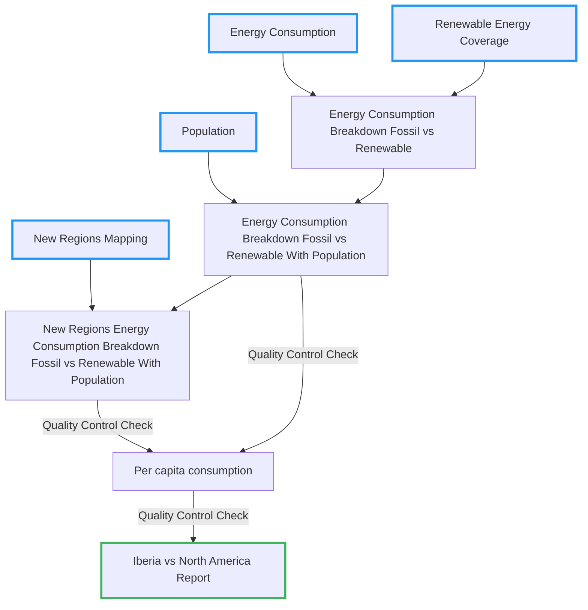

## Scene: The Trust Question

María's renewable energy coverage analysis pipeline is running beautifully. During her first UN policy presentation, a senior analyst asks: **_Can we trust the energy consumption estimates are accurate?_**


María realizes: _A successful pipeline run isn't the same as trustworthy results. Quality Control must be explicit and actionable._

### What We Will Learn

- Recognize why quality control is critical at different pipeline stages
- Build validation checks using `pandas` for your energy data
- Create systematic quality monitoring with `Dagster` asset checks

---

ℹ️ If you have fallen behind, you can `git checkout part_3` before starting this section.

For the `advanced` section, you can the re-run `dg dev` to restart your `Dagster` webserver.

---

## Data Architecture Evolution

In this section, we'll enhance our pipeline by adding systematic quality validation at critical points.



---

## What We Mean by Quality Control

We have two complementary pillars:

### Semantic QC (Already Covered in Part 1)
Using **Pandera** we ensured structure, types, and basic constraints:
- Required columns exist with correct types
- Values within expected ranges (e.g., population > 0)
- Schema consistency across pipeline runs

### Statistical QC (Today's Focus)
Goes deeper into content relationships within our energy data:
- **Conservation laws:** Do fossil + renewable percentages sum to 1.0?
- **Realistic bounds:** Are per-capita values within believable ranges?
- **Consistency:** Do calculations reconcile across transformations?

---

## QC at Multiple Levels: Input and Output

| Level | Purpose | Example Risk |
|-------|---------|--------------|
| **Input** (post-extract) | Build trust in sources early | Wrong data types slip through |
| **Output** (post-transform) | Certify calculations for consumption | Per-capita spikes from division errors |

> The later a defect is detected, the more expensive it is to fix.

---

## Basic Approach: Manual Pandas Assertions

María's first instinct: sprinkle `assert` statements throughout her code.

### Energy Conservation Check
```python
def calculate_energy_breakdown(df):
    # ...transformation logic...

    # Manual assertion scattered in code
    tolerance = 1e-6
    total_pct = df['fossil_energy_pct'] + df['renewable_energy_pct']
    assert abs(total_pct - 1.0).max() < tolerance, "Energy percentages don't sum to 1!"

    return df
```

### Per-Capita Threshold Check
```python
def calculate_per_capita_metrics(df):
    # ...calculations...

    # More scattered assertions
    max_threshold = 0.1  # 0.1 GWh per person per year ≈ 100 MWh
    assert df['energy_consumption_per_capita'].max() < max_threshold, "Per-capita too high!"

    return df
```

### Problems with This Approach:
- **Mixed concerns:** QC tangled with business logic
- **Poor visibility:** Generic error messages, no historical tracking
- **All-or-nothing:** Every assertion is blocking, no severity levels
- **Hard to maintain:** Changes require modifying transformation code

---

### Hands-on

Let's see the problems with scattered assertions in action. Try implementing a basic energy conservation check directly in your transformation and observe how it tangles QC concerns with business logic.

<details markdown="1">
<summary><strong>💡 Click to reveal solution</strong></summary>

```python
def calculate_energy_breakdown(df):
    # Business logic - calculate percentages
    df = df.assign(
        fossil_energy_pct=lambda x: x['fossil_energy_gwh'] / x['total_energy_gwh'],
        renewable_energy_pct=lambda x: x['renewable_energy_gwh'] / x['total_energy_gwh']
    )

    # QC logic mixed in - this is the problem!
    tolerance = 1e-6
    total_pct = df['fossil_energy_pct'] + df['renewable_energy_pct']
    assert abs(total_pct - 1.0).max() < tolerance, "Energy percentages don't sum to 1!"

    # More business logic continues...
    return df
```

Notice how the QC assertion is tangled with the business transformation logic, making both harder to understand and maintain.

</details>

---

## Advanced Approach: Dagster Asset Checks

`Dagster` treats quality control as **first-class citizens** through [Asset Checks](https://docs.dagster.io/guides/test/asset-checks). Asset checks are tests that verify specific properties of your data assets and are directly integrated within the orchestration workflow.

### Example: Per-Capita Plausibility Check

```python
@dg.asset_check(asset=energy_breakdown_per_capita)
def per_capita_plausibility_check(energy_breakdown_per_capita):
    """Validate realistic per-capita energy consumption bounds"""
    max_threshold = 0.1  # 100 MWh per person per year

    violations = (energy_breakdown_per_capita["energy_consumption_per_capita"] > max_threshold).sum()
    is_valid = int(violations) == 0

    return dg.AssetCheckResult(
        passed=is_valid,
        description=f"Per-capita bounds: {violations} violations (max allowed: {max_threshold} GWh)",
    )
```

---

### Hands-on

Implement an **energy conservation check** as part of your pipeline:

1. This check should enforce your estimated fossil vs renewable breakdown add up to `100%`, within a small tolerance.
2. Observe how the metadata and descriptions provide much better visibility than simple assertions.
3. Try triggering a validation failure and see the detailed error reporting in the `Dagster` UI.

<details markdown="1">
<summary><strong>💡 Click to reveal solution</strong></summary>

```python
@dg.asset_check(asset=energy_breakdown_with_new_regions)
def energy_conservation_check(energy_breakdown_with_new_regions):
    """Ensure fossil + renewable percentages sum to 1.0"""
    tolerance = 1e-6

    df_with_totals = energy_breakdown_with_new_regions.assign(
        total_pct=lambda x: x["fossil_energy_pct"] + x["renewable_energy_pct"]
    )

    invalid_count = int((abs(df_with_totals["total_pct"] - 1.0) > tolerance).sum())
    is_valid = invalid_count == 0
    total = len(energy_breakdown_with_new_regions)
    return dg.AssetCheckResult(
        passed=is_valid,
        description=f"Energy conservation: {invalid_count} invalid rows out of {total}",
    )
```

To trigger a validation failure for testing, modify your data to include unrealistic values:

```python
# Add to your energy_breakdown asset to test failure
df.loc[0, 'fossil_energy_pct'] = 0.6
df.loc[0, 'renewable_energy_pct'] = 0.5  # Now sums to 1.1, not 1.0
```

</details>

---

## Blocking vs Non-Blocking: Strategic Control

**Key Insight:** Not all quality issues should stop your pipeline.

### Blocking Checks (Pipeline Stops)
For critical violations that make downstream analysis meaningless:

```python
@dg.asset_check(asset=energy_breakdown, blocking=True)
def energy_conservation_check(energy_breakdown):
    """BLOCKS pipeline if energy percentages don't sum to 1"""
    ...
```

### Non-Blocking Checks (Monitor & Alert)
For warnings and trend monitoring:

```python
@dg.asset_check(asset=per_capita_energy_metrics, blocking=False)
def per_capita_plausibility_check(per_capita_energy_metrics):
    """MONITORS per-capita bounds but doesn't stop pipeline"""
    ...
```

### When to Use Each?

**Strategic Decision Framework:**

**Choose Blocking when:**
- The violation makes downstream calculations mathematically incorrect
- Policy decisions would be fundamentally flawed with bad data
- Manual intervention is required to fix the root cause

**Choose Non-Blocking when:**
- Data can be corrected automatically (interpolation, defaults)
- The issue is for monitoring trends rather than stopping work
- You want to collect violation patterns over time

**Examples from María's Energy Pipeline:**
- **Energy conservation (blocking):** If fossil + renewable ≠ 1.0, all per-capita calculations are wrong → Stop pipeline
- **Per-capita outliers (non-blocking):** High values might be real (oil-rich nations) → Monitor but continue
- **Missing population (blocking):** Can't calculate per-capita without population → Stop pipeline
- **Year-over-year spikes (non-blocking):** Could indicate policy changes → Monitor trends

---

### Hands-on

1. Take the *energy conservation check* and configure it as blocking.
2. Take the *per-capita plausability* check and configure it as non-blocking.

Run your pipeline with intentionally bad data to see how blocking stops execution while non-blocking allows continuation with warnings.

<details markdown="1">
<summary><strong>💡 Click to reveal solution</strong></summary>

```python
@dg.asset_check(asset=energy_breakdown_per_capita, blocking=False)
def per_capita_plausibility_check(energy_breakdown_per_capita):
    """Validate realistic per-capita energy consumption bounds"""
    max_threshold = 0.1  # 100 MWh per person per year

    violations = (energy_breakdown_per_capita["energy_consumption_per_capita"] > max_threshold).sum()
    is_valid = int(violations) == 0

    return dg.AssetCheckResult(
        passed=is_valid,
        description=f"Per-capita bounds: {violations} violations (max allowed: {max_threshold} GWh)",
    )

@dg.asset_check(asset=energy_breakdown_with_new_regions, blocking=True)
def energy_conservation_check(energy_breakdown_with_new_regions):
    """Ensure fossil + renewable percentages sum to 1.0"""
    tolerance = 1e-6

    df_with_totals = energy_breakdown_with_new_regions.assign(
        total_pct=lambda x: x["fossil_energy_pct"] + x["renewable_energy_pct"]
    )

    invalid_count = int((abs(df_with_totals["total_pct"] - 1.0) > tolerance).sum())
    is_valid = invalid_count == 0
    total = len(energy_breakdown_with_new_regions)
    return dg.AssetCheckResult(
        passed=is_valid,
        description=f"Energy conservation: {invalid_count} invalid rows out of {total}",
    )
```

Test with intentionally bad data:
```python
# In your energy_breakdown asset, add invalid percentages
df.loc[0, 'fossil_energy_pct'] = 0.7
df.loc[0, 'renewable_energy_pct'] = 0.4  # Sums to 1.1 - will BLOCK pipeline

# In your per_capita_energy_metrics asset, add unrealistic values
df.loc[0, 'energy_consumption_per_capita_gwh'] = 0.5  # Will log warning but continue
```

</details>

---

## Extras: Scaling QC with External Tools Within Your Python Workflow

As María's renewable energy analysis grows in scope and organizational adoption, she encounters scenarios where Dagster's built-in asset checks need to be supplemented:

**Why External QC Tools?**
- **Multi-language teams:** SQL analysts who can't read Python validation logic
- **Centralized governance:** QC rules managed separately from pipeline code
- **Performance at scale:** Large datasets requiring specialized analytical engines
- **Cross-pipeline consistency:** Same validation rules across different data workflows

Can she create a mixed data system that supports multiple tooling within the same Dagster pipeline?

### Soda Core + DuckDB: Combined External Validation

A well-known quality control framework is [soda-core](https://docs.soda.io/overview-main). On its own, it offers the flexibility to choose the backend for data extraction and processing.

For example, you can combine it with another powerful tool, [DuckDB](https://duckdb.org/), which provides a highly efficient analytical engine.

Although this runs outside your native `python` context, you can still orchestrate the workflow seamlessly with `Dagster`.

```yaml
# energy_checks.yml - Simple, business-readable rules
checks for energy_per_capita:
  - max(energy_consumption_per_capita) <= 0.1
  - missing_count(renewable_energy_pct) = 0
  - min(fossil_energy_pct + renewable_energy_pct) >= 0.99
```

```python

import duckdb
from soda.scan import Scan
import tempfile

@dg.asset_check(asset=energy_breakdown_per_capita)
def external_energy_validation(energy_breakdown_per_capita):
    """Combined Soda Core + DuckDB validation"""
    # Export to parquet for external validation
    with tempfile.NamedTemporaryFile(suffix=".parquet", delete=False) as temp_file:
        per_capita_energy_metrics.to_parquet(temp_file.name)
        parquet_file_path = temp_file.name

    # Use DuckDB as analytical engine + Soda Core for rule management
    with duckdb.connect(":memory:") as con:
        con.sql(f"CREATE VIEW energy_per_capita AS SELECT * FROM read_parquet('{parquet_file_path}')")

        scan = Scan()
        scan.add_duckdb_connection(con)
        scan.set_data_source_name("duckdb")
        my_checks = ... load checks file ...
        scan.add_sodacl_yaml_str(my_checks)
        scan.execute()

    return AssetCheckResult(
        passed=not scan.has_check_fails(),
        description="External Soda Core + DuckDB validation",
    )
```

**Combined Value:**
- **DuckDB:** High-performance analytical engine for large datasets
- **Soda Core:** Business-readable validation rules in YAML
- **Separation of concerns:** QC rules managed independently from pipeline code
- **Cross-team collaboration:** SQL analysts can modify rules without touching Python

### When to Graduate to External Tools?
- Multi-team ownership of QC rules
- Need centralized governance & audit trails
- Higher volume datasets requiring specialized analytical engines

---

## Hands-on

Create a simple YAML file with Soda Core rules for your energy data. Run the external validation and observe how the rules are separated from your Python pipeline code. Discuss when this approach would be valuable for your organization.

<details markdown="1">
<summary><strong>💡 Click to reveal solution</strong></summary>

```yaml
# Create energy_checks.yml file
checks for energy_per_capita:
  - max(energy_consumption_per_capita_gwh) <= 0.1:
      name: Per-capita energy consumption within realistic bounds
  - missing_count(energy_consumption_per_capita_gwh) = 0:
      name: No missing energy consumption values
  - min(energy_consumption_per_capita_gwh) >= 0:
      name: Energy consumption cannot be negative
  - row_count between 50 and 10000:
      name: Reasonable number of data points
```

```python
# Add to your assets.py file
@dg.asset_check(asset=energy_breakdown_per_capita)
def external_energy_validation(energy_breakdown_per_capita):
    """Run external Soda Core validation"""
    parquet_file_path = 'metrics.parquet'
    per_capita_energy_metrics.to_parquet(parquet_file_path)
    max_per_capita = 0.1
    with duckdb.connect(":memory:") as con:
        con.sql(
            f"""
            CREATE VIEW energy_per_capita AS
            SELECT * FROM read_parquet('{parquet_file_path}')
            """
        )
        scan = Scan()
        scan.add_duckdb_connection(con)
        scan.set_data_source_name("duckdb")
        sodacl = ... read checks file ...
        scan.add_sodacl_yaml_str(sodacl)
        scan.execute()
        
    # Print results matching original format
    passed = not scan.has_check_fails()

    return AssetCheckResult(
        passed=passed,
        description="External Soda Core + DuckDB validation",
    )
```
</details>

---

## Moment of Discovery

> By implementing systematic quality control at strategic pipeline stages with both blocking and non-blocking checks, we've transformed from "hoping our data is correct" to "knowing our data meets business requirements" - enabling confident decision-making.

**Next:** Explore advanced, but essential concepts in orchestration and Dagster.
